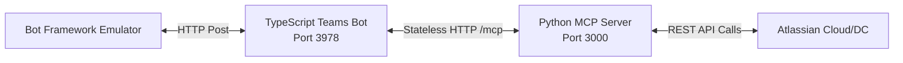

This guide outlines the precise steps needed to set up, launch, and test the multi-tenant **Confluence-MCP-Chatbot** application locally, utilizing the Python MCP Server and the Node.js/TypeScript Teams Bot.

## Architectural Diagram

The following diagram illustrates the local communication flow between components:



---

## Prerequisites

Before launching the servers, ensure all dependencies are downloaded. 
If you haven't installed them yet, execute the following:

1. **Python Dependencies** (via `uv`):
   ```bash
   uv sync --frozen --all-extras --dev
   ```
2. **Teams Bot Dependencies** (via `npm`):
   ```bash
   cd teams-bot
   npm install
   ```

---

## Step-by-Step Launch Guide

### Step 1: Spin up the Python MCP Server

The Teams Bot connects to the MCP server statelessly over HTTP using Bring Your Own Token (BYOT) headers. We must boot the server with the `streamable-http` transport and the `--stateless` flag.

1. Open a terminal in the root workspace directory.
2. Run the following command:
   ```bash
   uv run mcp-atlassian --transport streamable-http --stateless --port 3000
   ```
   
   *You should see output indicating the server is active:*
   ```text
   Starting server with STREAMABLE-HTTP transport on http://0.0.0.0:3000/mcp
   ```

---

### Step 2: Configure the Teams Bot Environment

1. Navigate to the `teams-bot/` directory.
2. Copy the `.env.example` file to `.env`:
   ```bash
   copy .env.example .env
   ```
3. Open `.env` and fill in the required variables:
   * **`ENCRYPTION_KEY`**: A secure 32-character string used to encrypt the user credentials inside the local database. You can generate a random hex string with:
     ```bash
     openssl rand -hex 16
     ```
   * **`AI_API_KEY`**: Enter your LLM provider's API key (e.g. GitHub Personal Access Token, OpenAI API Key, or Azure OpenAI Key).
   * **`AI_ENDPOINT`**: Leave as `https://models.inference.ai.azure.com` if using GitHub Models, or set your custom Azure OpenAI resource URL.
   * **`MCP_SERVER_URL`**: Set to `http://localhost:3000/mcp` (matches the port of the Python server).
   * **`PORT`**: Default is `3978`.

---

### Step 3: Run the Teams Bot

1. Open a separate terminal and navigate into the `teams-bot` folder:
   ```bash
   cd teams-bot
   ```
2. Run the development server (which compiles TypeScript and loads your `.env` dynamically):
   ```bash
   npm run dev
   ```
   
   *The server starts listening:*
   ```text
   Bot listening at http://localhost:3978/api/messages
   ```

---

## Local Testing with Bot Framework Emulator

To test the bot's end-to-end functionality locally without publishing it to Microsoft Teams, you can use the **Microsoft Bot Framework Emulator**.

### 1. Connect the Emulator
1. Download and launch the **[Bot Framework Emulator](https://github.com/microsoft/botframework-emulator)**.
2. Click **Open Bot**.
3. In the **Bot URL** field, enter:
   ```text
   http://localhost:3978/api/messages
   ```
4. Leave **Microsoft App ID** and **Microsoft App Password** blank (matching the local configuration in `.env`).
5. Click **Connect**.

### 2. Enter Credentials (The Authentication Card)
1. Send any initial message in the chat (e.g., `Hello` or `/help`).
2. The bot will automatically detect that you do not have credentials saved. It will reply with an **Adaptive Card** form:
   * **Jira Instance URL** (e.g. `https://your-domain.atlassian.net`)
   * **Jira Personal Access Token (PAT)** or Cloud API token.
   * **Confluence Instance URL** (optional).
   * **Confluence PAT** or Cloud API token (optional).
3. Click **Connect**. The bot encrypts these credentials and registers your session.

### 3. Query Atlassian Services
Now you can prompt the bot using natural language to perform complex Jira and Confluence workflows:
* *“What are my high priority unresolved Jira issues?”*
* *“Search Confluence pages about API design.”*
* *“Create a new Jira Bug in project PROJ with summary 'Database timeout on checkout'”*

---

## Troubleshooting & Tips

* **Early Disconnections**: If the Teams bot closes connection requests early, the Python MCP server intercepts `ConnectionResetError` gracefully without terminating. 
* **SSL Verification Issues**: If you are working behind corporate proxies with custom certificates, ensure `MCP_ATLASSIAN_USE_SYSTEM_TRUSTSTORE=true` is set in the environment so the server utilizes the native Windows Certificate Store via `truststore`.
* **Verbosity**: To see detailed payload traces on the Python MCP Server, start it with `-v` (INFO level) or `-vv` (DEBUG level):
  ```bash
  uv run mcp-atlassian --transport streamable-http --stateless --port 3000 -vv
  ```
